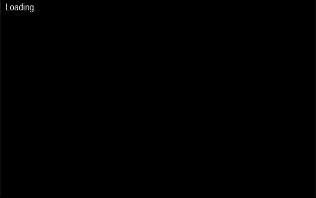

# Ray tracing engine
A ray tracer in Python made for the final project in the course DD1331 Fundamentals of Programming at KTH. The program loads a sphere which moves the light source based on where on the sphere the user clicks.  

Inspired by [Arun's](https://github.com/arocks/puray) ray tracer.